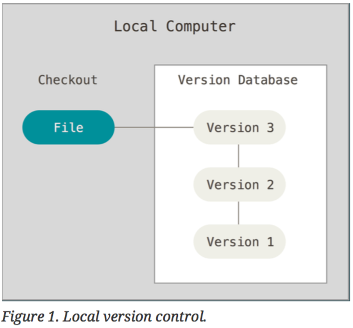
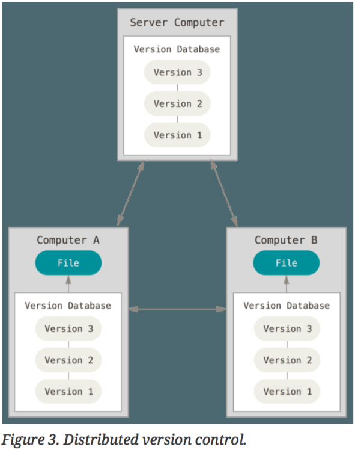
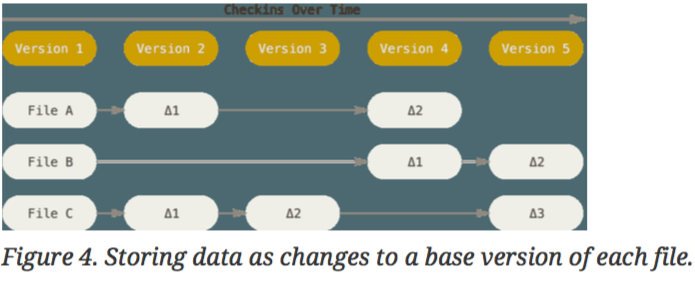
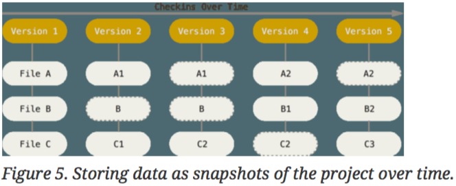
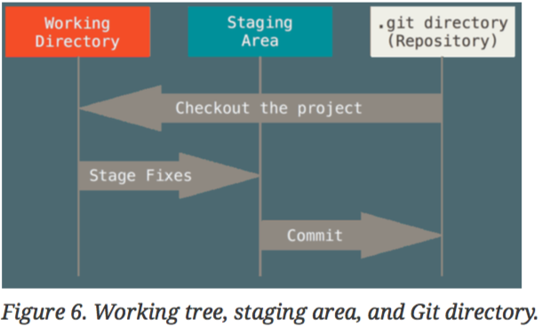

# Git
# Awesomeness

---
## Characteristics

* Distributed version control
* Snapshots, not differences
* Integrity by using SHA-1 checksums
* Fast by doing operations locally

---
### Local version control



---
### Centralized version control


---
### Distributed version control



---
### Snapshots, not differences




---
### Integrity by using
### SHA-1 checksums

```ruby
require 'digest'

Digest::SHA1.hexdigest '<some awesome code>'
=> "ad23275837d17962d3deaa004d663e76c4fb17f1"
```
---
### Fast by doing operations
### locally

```bash
$ ls -a

drwxr-xr-x   7 jesus  staff   224B Feb  9 11:47 ./
drwxr-xr-x@  7 jesus  staff   224B Feb  1 16:30 ../
drwxr-xr-x  11 jesus  staff   352B Feb  9 11:47 .git/
-rw-r--r--   1 jesus  staff    13B Feb  1 17:03 config.yml
drwxr-xr-x   7 jesus  staff   224B Feb  9 11:39 images/
drwxr-xr-x  12 jesus  staff   384B Feb  9 11:29 slides/
-rw-r--r--   1 jesus  staff   998B Feb  9 11:47 slides.md
```

---
## Basic config

```bash
$ git config --global user.name "Jesús Abarca"
$ git config --global user.email jesus@abarca.xyz
```

---
## Getting a repo

Initialize a new repo
```bash
$ git init
```
or:

Clone an existing repo
```bash
$ git clone https://github.com/jesusabarca/basic-git.git
```

---
## Checking the status
## of a repo

```bash
$ git status
```

```bash
On branch master

No commits yet

Changes to be committed:
  (use "git rm --cached <file>..." to unstage)

        new file:   slides.md

Untracked files:
  (use "git add <file>..." to include in what will be committed)

        config.yml
        images/
        slides/
```

---
## Untracked
## vs
## tracked files

---
## Ignoring files

```bash
$ cat .gitignore
```

```bash
*.a
build/
doc/*.txt
```

* Ignoring new files
vs
* Ignoring already tracked files

---
## Three states of
## "tracked"



---
## Staging changes

```bash
$ git add some_file.rb
```

* Staging untracked files
vs
* Staging already tracked files

---
#### Note: a file can be on different
#### states of "tracked" at once

```bash
$ git status
```

```bash
On branch master

No commits yet

Changes to be committed:
  (use "git rm --cached <file>..." to unstage)

        new file:   slides.md

Changes not staged for commit:
  (use "git add <file>..." to update what will be committed)
  (use "git checkout -- <file>..." to discard changes in working directory)

        modified:   slides.md
```

---
## Viewing changes

* Unstaged changes

```bash
$ git diff
```

* Staged changes

```bash
$ git diff --staged
```

---
## Commiting changes
## (snapshots)

* With text editor

```bash
$ git commit
```

```bash
$ git config --global core.editor nvim
```

* Inline comment

```bash
$ git commit -m 'An awesome commit message.'
```

---
## Removing files

```bash
$ rm slides.md
```

```bash
$ git status
On branch master
Changes not staged for commit:
  (use "git add/rm <file>..." to update what will be committed)
  (use "git checkout -- <file>..." to discard changes in working directory)

        deleted:    slides.md

no changes added to commit (use "git add" and/or "git commit -a")
```

```bash
$ git add slides.md
```

```bash
$ git status
On branch master
Changes to be committed:
  (use "git reset HEAD <file>..." to unstage)

        deleted:   slides.md
```

---
## Removing files
### (with one command)

```bash
$ git rm slides.md
```

```bash
$ git status
On branch master
Changes to be committed:
  (use "git reset HEAD <file>..." to unstage)

        deleted:   slides.md
```

---
## Moving files

```bash
$ mv slides.md slides2.md
$ git rm slides.md
$ git status
On branch master
Changes to be committed:
  (use "git reset HEAD <file>..." to unstage)

        deleted:    slides.md

Untracked files:
  (use "git add <file>..." to include in what will be committed)

        slides2.md
```

```bash
$ git add slides2.md
$ git status
On branch master
Changes to be committed:
  (use "git reset HEAD <file>..." to unstage)

        renamed:    slides.md -> slides2.md
```

---
## Moving files
### (with one command)

```bash
$ git mv slides.md  slides2.md
```

```bash
$ git status
On branch master
Changes to be committed:
  (use "git reset HEAD <file>..." to unstage)

        renamed:    slides.md -> slides2.md
```

---
## Fixing thingz

---
## Reverting changes
### (on the working directory)

```bash
$ git checkout -- slides.md
```

---
## Reverting changes
### (already stagged)

For all files
```bash
$ git reset
$ git reset HEAD
```

For specific files
```bash
$ git reset HEAD slides.md
```

😱 Note: be careful with
```bash
$ git reset --hard
```
It will also revert all changes in the working directory

---
## Reverting changes
### (already commited)

```bash
$ git commit --amend
```
🤔 Note: it will also include all new staged changes
